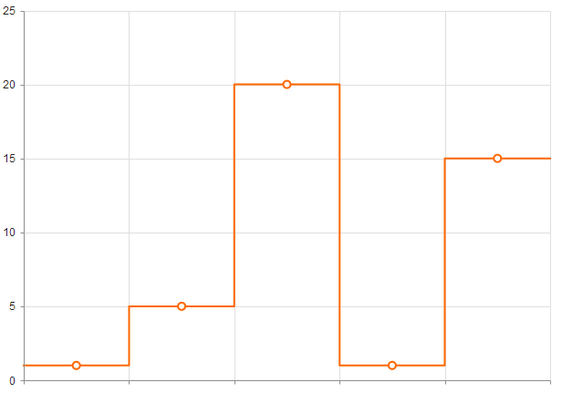
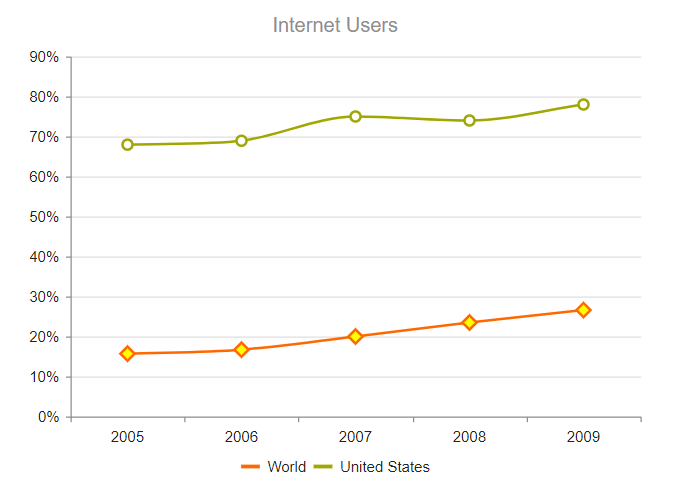

# Line Charts

The Telerik UI Line Chart HtmlHelper for ASP.NET Core extension is a server-side wrapper for the Kendo UI Line Chart widget.

Line Charts are suitable for displaying quantitative data by using continuous lines passing through points defined by the values of their items.

* [Demo page for the Line Chart](https://demos.telerik.com/aspnet-core/line-charts/index)

## Getting Started

You can use the Line Chart HtmlHelper to render a trend over time and compare sets of similar data.

To create a Line series in the Chart HtmlHelper, use `Line` and `VerticalLine` in the `Series` configuration.

* [Configuring the axes](#configuring-the-axes)
* [Configuring the line styles](#configuring-the-line-styles)
* [Setting the type of lines](#setting-the-type-of-lines)
* [Customizing the markers](#customizing-the-markers)

## Configuring the Axes

To configure the axes, use the `CategoryAxis` and `ValueAxis` settings. Multiple value axes are also supported.

    @(Html.Kendo().Chart()
         .Name("chart")
         .Title("Internet Users")
         .Legend(legend => legend
             .Position(ChartLegendPosition.Bottom)
         )
         .Series(series =>
         {
             series.Line(new double[] { 15.7, 16.7, 20, 23.5, 26.6 }).Name("World");
             series.Line(new double[] { 67.96, 68.93, 75, 74, 78 }).Name("United States");
         })
         .CategoryAxis(axis => axis
             .Categories("2005", "2006", "2007", "2008", "2009")
             .MajorGridLines(lines => lines.Visible(false))
         )
         .ValueAxis(axis => axis
             .Numeric().Labels(labels => labels.Format("{0}%"))
         )
    )

The configuration from the previous example results in the following Line Chart.

**Figure 1: A sample Line Chart**


## Configuring the Line Styles

The Line Charts support the rendering of lines between points by using different styles.

The supported line styles are:

* Normal&mdash;This is the default style. It produces a straight line between data points.
* Step&mdash;This style renders the connection between data points through vertical and horizontal lines. It is suitable for indicating that the value is constant between the changes.
* Smooth&mdash;This style causes the Line Chart to display a fitted curve through data points. It is suitable when the data requires to be displayed with a curve, or when you wish to connect the points with smooth instead of straight lines.

You can set the line style through the `Style` configuration in the `SeriesDefaults` common settings.

```
   .SeriesDefaults(seriesDefaults =>
       seriesDefaults.Line().Style(ChartLineStyle.Smooth)
   )
```

You can also set the line style for each Line series individually.

```
   .Series(series =>
   {
       series.Line(new double[] { 15.7, 26.7, 20, 23.5, 26.6 }).Name("World").Style(ChartLineStyle.Smooth);
       series.Line(new double[] { 67.96, 68.93, 75, 54, 78 }).Name("United States").Style(ChartLineStyle.Smooth);
   })
```

**Figure 2: A step-line Line Chart**



**Figure 3: A smooth-line Line Chart**


## Setting the Type of Lines

By default, the Chart draws its Line series as solid lines. You can configure the line to be drawn through different dash styles by setting `DashType`.

```
     .Series(series =>
     {
         series.Line(new double[] { 15.7, 16.7, 20, 23.5, 26.6 }).Name("World").DashType(ChartDashType.Dot);
         series.Line(new double[] { 67.96, 68.93, 75, 74, 78 }).Name("United States");
     })
```

**Figure 4: A dotted Line Series**


## Customizing the Markers

The series markers are the visuals that represent the point value in the Line series. You can customize or hide them through the `Markers` configuration.

```
   series.Line(new double[] { 15.7, 16.7, 20, 23.5, 26.6 }).Name("World")
      .Markers(m=>m
          .Type(ChartMarkerShape.Square)
          .Rotation(45)
          .Background("yellow")
      );
```

**Figure 5: A Line Chart with custom markers**



You can also completely draw custom markers for the Line series through the `Visual` setting as shown in the [Custom Visuals](https://demos.telerik.com/aspnet-core/line-charts/visuals) demo.

## See Also

* [Basic Usage of the Line Chart HtmlHelper for ASP.NET Core (Demo)](https://demos.telerik.com/aspnet-core/line-charts/index)
* [Server-Side API](/api/chart)
