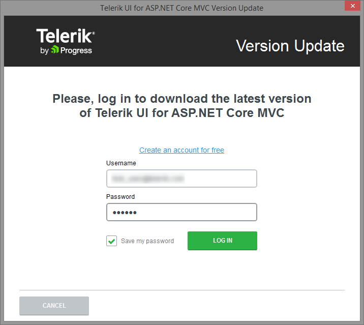

# Download New Versions

With the Telerik UI for ASP.NET Core Visual Studio Extensions you keep your projects in an up-to-date state. The Latest Version Acquirer tool automatically retrieves the latest Telerik UI for ASP.NET Core distribution available on the Telerik website.

**Figure 1. The Get the Latest Version dialog**

> **Important**
>
> You cannot use the tool if you have a trial license. Attempting to download a distribution results in an error message.

Check for any additional information about the release by clicking the **Release Notes** link. This starts a browser, navigating to a page with the release notes related to the specific version.

Use the **Save my password** checkbox to avoid having to enter your Telerik credentials multiple times. The persistence is done in a secure manner and credentials are saved in a per-user context. Other users on the machine do not have access to your stored credentials.

The download starts automatically after a confirmation window.

**Figure 2, 3 and 4. The dialog indicating the download progress**

Once the download succeeds, the latest version of Telerik UI for ASP.NET Core is available to use in the **New Project Wizard**.

> **Important**
> * The Download buttons of the **New Project Wizard** launch the **Latest Version Acquirer** tool.
> * The **Latest Version Acquirer** tool downloads the `.zip` files, containing the latest Telerik UI for ASP.NET Core binaries and any resources vital for a Telerik UI for ASP.NET Core application. These get unpacked to the `%APPDATA%\Telerik\Updates` folder by default. If you find the list of packages offered too long and you do not need the older versions, close the Visual Studio and use the Windows Explorer to delete these distributions.

## See Also

* [Visual Studio Integration Overview]()
* [Create Projects]()
