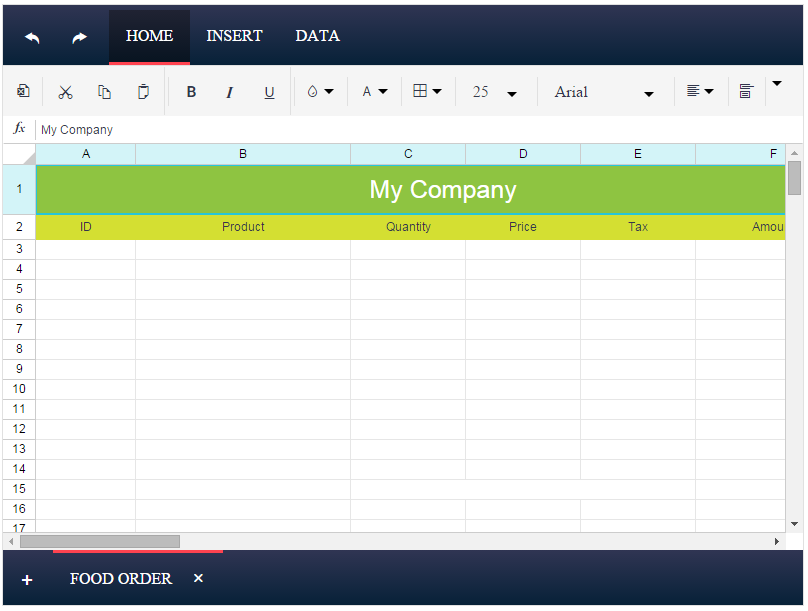

# Spreadsheet HtmlHelper Overview

The Telerik UI Spreadsheet HtmlHelper for ASP.NET MVC is a server-side wrapper for the Kendo UI Spreadsheet widget.

The Spreadsheet allows you to edit and visualize tabular data by using cell formatting options, styles, and themes.

* [Demo page for the Spreadsheet](https://demos.telerik.com/aspnet-mvc/spreadsheet/index)

## Basic Configuration

1. Create a new ASP.NET MVC 5 application using any of the following templates:

    * Telerik UI for ASP.NET MVC application. It is available after installing the [Telerik UI for ASP.NET MVC Visual Studio Extensions]().
    * Default Visual Studio template. Follow the steps from the [introductory article on Telerik UI for ASP.NET MVC]() to set up to the application.

1. Add a Spreadsheet to the `Index` view in `Views/Home/Index.cshtml`.

    ```ASPX
        <%:Html.Kendo().Spreadsheet()
            .Name("spreadsheet")
            .Sheets(sheets => {
                sheets.Add()
                    .Name("Food Order")
                    .MergedCells("A1:F1", "C15:E15")
                    .Columns(columns =>
                    {
                        columns.Add().Width(100);
                        columns.Add().Width(215);
                        columns.Add().Width(115);
                        columns.Add().Width(115);
                        columns.Add().Width(115);
                        columns.Add().Width(155);
                    })
                    .Rows(rows =>
                    {
                        rows.Add().Height(50).Cells(cells =>
                        {
                            cells.Add()
                                .Value("My Company")
                                .FontSize(25)
                                .Background("rgb(142,196,65)")
                                .TextAlign(SpreadsheetTextAlign.Center)
                                .Color("white");
                        });

                        rows.Add().Height(25).Cells(cells =>
                        {
                            cells.Add()
                                .Value("ID")
                                .Background("rgb(212,223,50)")
                                .TextAlign(SpreadsheetTextAlign.Center);

                            cells.Add()
                                .Value("Product")
                                .Background("rgb(212,223,50)")
                                .TextAlign(SpreadsheetTextAlign.Center);

                            cells.Add()
                                .Value("Quantity")
                                .Background("rgb(212,223,50)")
                                .TextAlign(SpreadsheetTextAlign.Center);

                            cells.Add()
                                .Value("Price")
                                .Background("rgb(212,223,50)")
                                .TextAlign(SpreadsheetTextAlign.Center);

                            cells.Add()
                                .Value("Tax")
                                .Background("rgb(212,223,50)")
                                .TextAlign(SpreadsheetTextAlign.Center);

                            cells.Add()
                                .Value("Amount")
                                .Background("rgb(212,223,50)")
                                .TextAlign(SpreadsheetTextAlign.Center);
                        });
                    });
                })
        %>
    ```
    ```Razor
        @(Html.Kendo().Spreadsheet()
            .Name("spreadsheet")
            .Sheets(sheets => {
                sheets.Add()
                    .Name("Food Order")
                    .MergedCells("A1:F1", "C15:E15")
                    .Columns(columns =>
                    {
                        columns.Add().Width(100);
                        columns.Add().Width(215);
                        columns.Add().Width(115);
                        columns.Add().Width(115);
                        columns.Add().Width(115);
                        columns.Add().Width(155);
                    })
                    .Rows(rows =>
                    {
                        rows.Add().Height(50).Cells(cells =>
                        {
                            cells.Add()
                                .Value("My Company")
                                .FontSize(25)
                                .Background("rgb(142,196,65)")
                                .TextAlign(SpreadsheetTextAlign.Center)
                                .Color("white");
                        });

                        rows.Add().Height(25).Cells(cells =>
                        {
                            cells.Add()
                                .Value("ID")
                                .Background("rgb(212,223,50)")
                                .TextAlign(SpreadsheetTextAlign.Center);

                            cells.Add()
                                .Value("Product")
                                .Background("rgb(212,223,50)")
                                .TextAlign(SpreadsheetTextAlign.Center);

                            cells.Add()
                                .Value("Quantity")
                                .Background("rgb(212,223,50)")
                                .TextAlign(SpreadsheetTextAlign.Center);

                            cells.Add()
                                .Value("Price")
                                .Background("rgb(212,223,50)")
                                .TextAlign(SpreadsheetTextAlign.Center);

                            cells.Add()
                                .Value("Tax")
                                .Background("rgb(212,223,50)")
                                .TextAlign(SpreadsheetTextAlign.Center);

                            cells.Add()
                                .Value("Amount")
                                .Background("rgb(212,223,50)")
                                .TextAlign(SpreadsheetTextAlign.Center);
                        });
                    });
            })
        )
    ```

1. Build and run the application.

    

## Functionality and Features

The Spreadsheet provides options for [server-side processing of data]().

## Events

You can subscribe to all Spreadsheet [events](/api/spreadsheet). For a complete example on basic Spreadsheet events, refer to the [demo on using the events of the Spreadsheet](https://demos.telerik.com/aspnet-mvc/spreadsheet/events).

### Handling by Handler Name

The following example demonstrates how to subscribe to events by a handler name.

```ASPX
    <%:Html.Kendo().Spreadsheet()
        .Name("spreadsheet")
        .Events(e => e
            .Render("spreadsheetRender")
        )
    %>

    <script>
        function spreadsheetRender() {
            // Handle the render event.
        }
    </script>
```
```Razor
    @(Html.Kendo().Spreadsheet()
        .Name("spreadsheet")
        .Events(e => e
            .Render("spreadsheetRender")
        )
    )

    <script>
        function spreadsheetRender() {
            // Handle the render event.
        }
    </script>
```

### Handling by Template Delegate

The following example demonstrates how to subscribe to events by a template delegate.

    @(Html.Kendo().Spreadsheet()
        .Name("spreadsheet")
        .Events(e => e
            .Render(@<text>
                function() {
                    // Handle the render event inline.
                }
            </text>)
        )
    )

## Referencing Existing Instances

To reference an existing Spreadsheet instance, use the [`jQuery.data()`](http://api.jquery.com/jQuery.data/) configuration option. Once a reference is established, use the [Spreadsheet API](http://docs.telerik.com/kendo-ui/api/javascript/ui/spreadsheet#methods) to control its behavior.

    @(Html.Kendo().Spreadsheet()
        .Name("spreadsheet")
    )

    <script>
        $(function() {
            // The Name() of the Spreadsheet is used to get its client-side instance.
            var spreadsheet = $("#spreadsheet").data("kendoSpreadsheet");
        });
    </script>

## See Also

* [Basic Usage of the Spreadsheet HtmlHelper for ASP.NET MVC (Demo)](https://demos.telerik.com/aspnet-mvc/spreadsheet/index)
* [API Reference of the Spreadsheet HtmlHelper for ASP.NET MVC](/api/spreadsheet)
